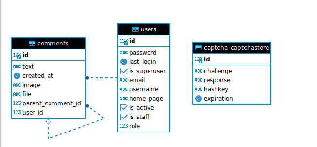

# Run using docker:

## Run
clone the project

add .env file

run:

`docker-compose up -d --build`

next time you can use:

`docker-compose up -d`

go to http://localhost:8009/users/login/

The project is in debug mode: Media files are saved inside the project without external services.

Pagination works with a few comments for easy testing.

You can find created tables view here: 
